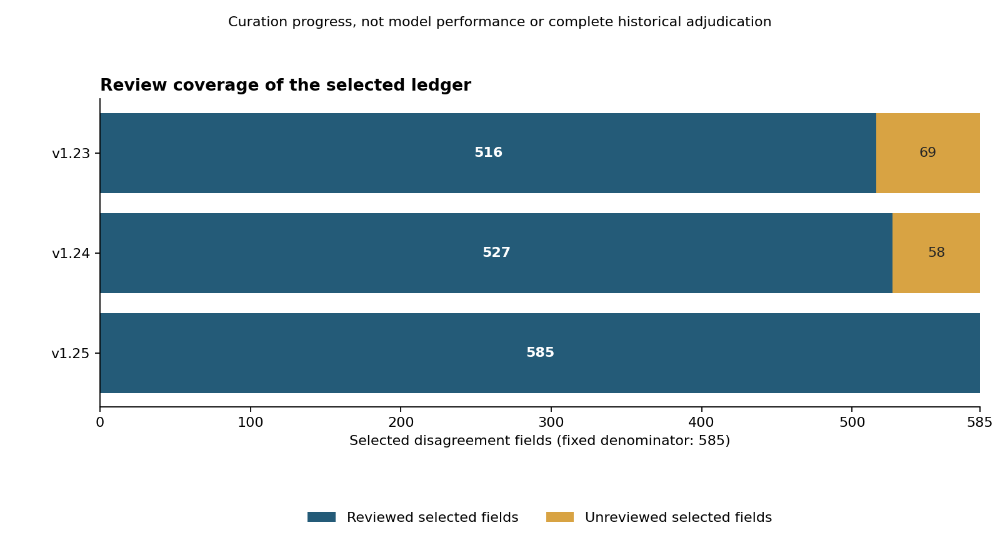

# Selected results and failure modes

These are historical observations projected into newly curated data. Primary requests and original metrics were checked locally. Their complete contents remain private, so public readers can verify arithmetic and consistency of the projection, not independently audit every historical response. [Claims](claims.json) record this distinction; [provenance](provenance.json) contains safe identity references.

## Bounded-edit observations

Each record concerns five supplied target substitutions. Admission counts and exact reference-file matches are different outcomes. UNKNOWN means no evaluable delivery; it is not zero semantic accuracy. Reference equality is an in-memory comparison, not five independently proven engineering fixes. All rows share fixture families; rescue conditions are not matched primary comparisons.

| Record | Historical model tag | Condition | Context | Delivery | Admitted / 5 | Exact reference matches / 5 |
| --- | --- | --- | ---: | --- | ---: | ---: |
| OBS-01 | gemma4:12b | main guarded | 32768 | no evaluable delivery | UNKNOWN | UNKNOWN |
| OBS-02 | gemma4:31b | main guarded | 16384 | evaluable proposal | 4 | 4 |
| OBS-03 | glm-4.7-flash:q4_K_M | main guarded | 32768 | evaluable proposal | 5 | 4 |
| OBS-04 | granite4.2:30b | main guarded | 16384 | no evaluable delivery | UNKNOWN | UNKNOWN |
| OBS-05 | qwen3.8:27b | main guarded | 32768 | evaluable proposal | 5 | 5 |
| OBS-06 | qwen3-coder:30b | main guarded | 32768 | evaluable proposal | 5 | 5 |
| OBS-07 | gemma4:31b | paired prompt; both constrained | 16384 | evaluable proposal | 0 | 0 |
| OBS-08 | gemma4:12b | separate reasoning-off rescue | 32768 | evaluable proposal | 0 | 0 |
| OBS-09 | granite4.2:30b | separate reasoning-off rescue | 16384 | evaluable proposal | 5 | 4 |

The [CSV](selected-edits.csv) includes every retained sampling option, output cap and evidence identity. OBS-01 through OBS-06 cover the six primary guarded records. OBS-07 is the earlier fixed-order Gemma31 constrained prompt; OBS-08 and OBS-09 are separate reasoning-off rescue records. No pooled score, best-model label or causal comparison is calculated.

## What the cases show

**Admission can change with output form.** The Gemma31 pair recorded zero then four admitted targets. Leading whitespace caused the earlier strict rejection; a declaration outside the statement grammar caused the remaining later rejection. Both prompts were constrained and shared recorded options. Fixed order, one seed and one fixture prevent attributing the difference to the validation notice or declaring rejected text semantically incorrect.

**Admission does not establish behavior.** In the GLM primary and Granite rescue records, all five proposals were admitted but only four resulting files matched references. Supplied deterministic fixture proofs identify, respectively, asynchronous property-access ordering and an envelope-versus-array result mismatch on the same selected target. These are narrow result-shape observations, with no production execution.

**Checks can reject a locally valid change.** Later researcher-constructed edit challenges included a comment quoting old source text. A text-pattern validator rejected the change; a comment-removal control changed admission without changing the tested local behavior. The complete migration was still incomplete. This is a selected rule boundary, not a measured validator false-rejection rate.

**A finite oracle can miss an untested branch.** A separately authored mutant passed historical checked inputs but failed a later second-input challenge: the fixture/reference required two rows and the mutant returned none. It was invented by an auditor, not naturally emitted by a model. Original scores and oracle remained unchanged.

## Reconciliation coverage

[Coverage CSV](reconciliation-coverage.csv) separates field review from assessment-unit counts. v1.23: 69 unreviewed selected fields; v1.24: 58; v1.25: zero. The final ledger contains 585 selected fields, a 152-ID join and 152 bounded assessment units. The final 32 related assessment units reuse 89 earlier control groups and add no model observations. Full historical adjudication remains incomplete; remaining contextual questions concern entitlement, durable storage, transaction/transport guarantees and generalization.

The [figure manifest](../figures/manifest.json) defines the denominator and transformation. It is a curation-progress chart, not an accuracy chart. [Limitations](../limitations.md) apply to every result.
